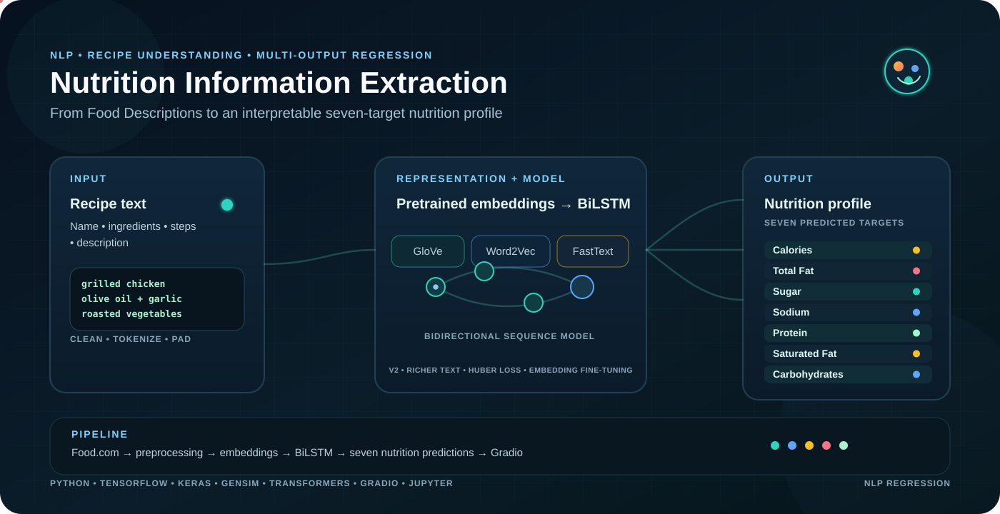

<p align="center">
  
</p>

<p align="center">
  
  
  
  
  
  
  
  
  
  
  
  
  
</p>

<h1 align="center">Nutrition Extraction from Food Descriptions</h1>

<p align="center">
  <em>Teaching a language model to read a recipe the way a nutrition label would.</em>
</p>

---

## About

Every recipe already contains its own nutrition facts — they're just hidden in the words instead of a label. This project explores whether a neural language model can learn to *read between the lines* of a recipe's name, ingredients, and steps, and infer its nutritional profile directly from that free text, without ever touching a lab measurement.

It's built as an end-to-end NLP pipeline: raw recipe text goes in, cleaned and tokenized; pretrained word embeddings give the model a sense of language; a bidirectional sequence model reads the recipe in both directions at once; and a regression head turns that understanding into a full nutritional breakdown — calories, fat, sugar, sodium, protein, saturated fat, and carbohydrates.

Several embedding strategies (GloVe, Word2Vec, FastText) are trained and compared side by side, with an optional transformer-based (DistilBERT) variant for a heavier, context-aware alternative. A small bonus classifier also explores whether the same signals can flag a recipe as broadly "healthy." The whole thing is wrapped in an interactive demo, so you can type in your own recipe and watch it get read.

## Use Cases

- **Recipe & meal-planning apps** — estimate nutrition for user-submitted recipes that don't come with a label
- **Diet & health platforms** — flag recipes matching dietary goals (high-protein, low-sugar, etc.) from text alone
- **Food bloggers & content creators** — auto-generate a plausible nutrition summary for a new recipe post
- **Calorie-tracking assistants** — parse a free-text meal description into structured nutrition data
- **NLP education & research** — a clean, well-documented example of text-to-numeric regression with embeddings and BiLSTMs
- **Dataset augmentation** — backfill missing nutrition fields in recipe datasets that only have descriptions

## How It Works

```
recipe text  →  clean & tokenize  →  pretrained embeddings  →  bidirectional sequence model  →  nutrition profile
```

1. **Text cleaning** — recipe name, description, ingredients, and steps are normalized into a single text field.
2. **Embeddings** — the vocabulary is mapped to pretrained word vectors (GloVe / Word2Vec / FastText), giving the model a head start on language understanding before it sees a single recipe.
3. **Sequence modeling** — a stacked bidirectional LSTM reads the text forward and backward simultaneously, building a representation of the whole recipe rather than just isolated words.
4. **Regression head** — a dense network turns that representation into a full nutrition profile in one shot.
5. **Refinement pass** — a second training stage folds in the recipe's preparation steps and sharpens the architecture, pushing every embedding variant toward tighter, more consistent predictions.
6. **Optional transformer path** — a frozen DistilBERT encoder offers a contextual, attention-based alternative to the embedding + BiLSTM approach.
7. **Interactive demo** — a Gradio app lets you type a recipe description and see its predicted nutrition profile instantly.

Across every variant, the goal is the same: get the model's read on a recipe as close as possible to what a real nutrition label would say — good precision, without ever seeing the actual food.

# Model flow

1. Recipe fields are converted into a single text representation.
2. The text is normalized and cleaned.
3. The training text is used to build a tokenizer vocabulary.
4. Token sequences are padded to a fixed length.
5. Nutrition targets are standardized using the training split.
6. Pretrained GloVe, Word2Vec, or FastText vectors are mapped to tokenizer vocabulary entries.
7. A BiLSTM model reads the sequence and produces seven continuous outputs.
8. In the v2 pipeline, the embedding layer is first kept frozen and then fine-tuned for the food/recipe domain.
9. Predictions are converted back to the original nutrition scale.
10. The saved v2 artifacts are loaded by the Gradio interface for interactive inference.


## Project Structure

```
.
├── assets/
│   └── banner.svg
├── notebooks/
│   └── Nutrition_Extraction_FoodCom_v2.ipynb
├── requirements.txt
├── .gitignore
├── LICENSE
└── README.md
```

> Trained model weights, downloaded embeddings, and the raw dataset are **not** part of the repo — they're regenerated locally by running the notebook (see below).

## Getting Started

**1. Clone the repo**
```bash
git clone https://github.com/alihasnain-se/Nutrition-Information-Extraction-From-Food-Descriptions
cd Nutrition-Information-Extraction-From-Food-Descriptions
```

**2. Install dependencies**
```bash
pip install -r requirements.txt
```

**3. Get the dataset**

The notebook pulls the [Food.com Recipes and User Interactions](https://www.kaggle.com/datasets/shuyangli94/food-com-recipes-and-user-interactions) dataset directly via `kagglehub` — no manual download needed, just a Kaggle account for API access.

**4. Run the notebook**

Open `notebooks/Nutrition_Extraction_FoodCom_v2.ipynb` in Jupyter, Colab, or your editor of choice, and run the cells top to bottom. Configuration (paths, which embeddings to train, whether to enable the BERT variant) lives in one clearly marked config cell near the top.

**5. Try the demo**

The last section of the notebook launches a Gradio interface — type in any recipe description and get an instant predicted nutrition profile.

## Acknowledgements

- Dataset: [Food.com Recipes and User Interactions](https://www.kaggle.com/datasets/shuyangli94/food-com-recipes-and-user-interactions) via Kaggle
- Pretrained embeddings: GloVe, Word2Vec, and FastText, via `gensim`
- Transformer backbone: DistilBERT, via Hugging Face `transformers`

## License

Released under the [MIT License](LICENSE).
<p align="center">
  Built as a practical NLP project for extracting nutrition information from recipe text.
</p>
